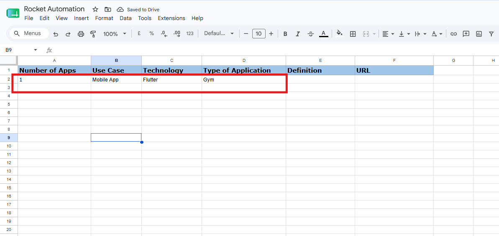
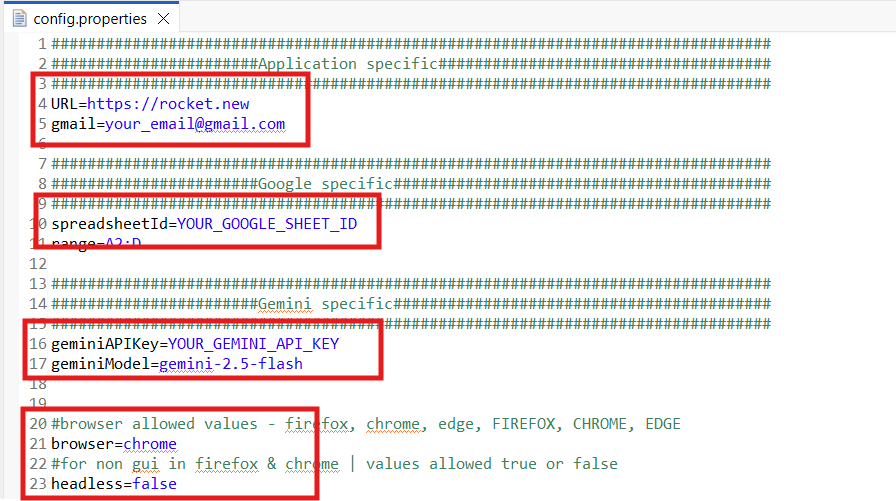
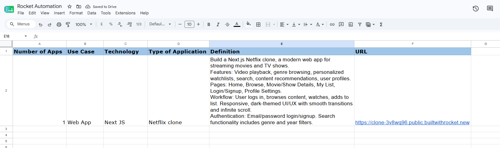
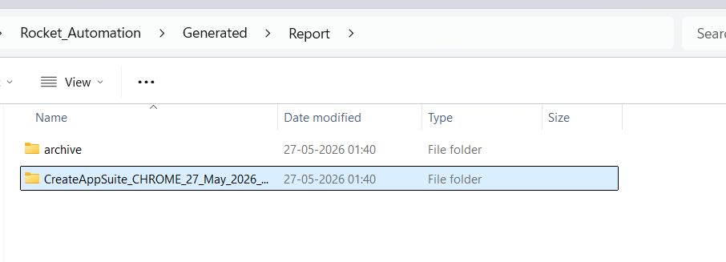
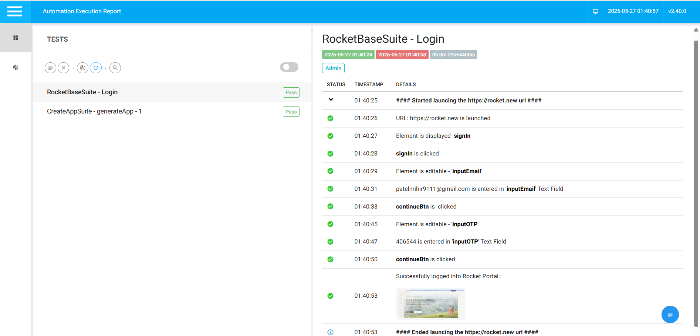

# 🚀 Rocket Process Automation

The project automates application generation on **Rocket.new** - login with **Gmail OTP**, read input from **Google Sheets**, generate prompts via **Gemini AI API**, create and launch the application, then store the generated prompt and published URL back into Google Sheets, launch generated application, analyze the generated app using and score it using Gemini AI.


## 📄 Requirements

- [View Project Requirements](./Data/Global/QA%20-%20Practical%20Assignment.pdf)


## ⚙️ Technology Stack

| Technology | Usage |
|---|---|
| Java | Core programming language |
| Selenium WebDriver | UI Automation |
| Playwright (Java) | Published app exploration and element extraction |
| TestNG | Test execution framework |
| Maven | Dependency management |
| Google Sheets API | Read input / Write results |
| Gmail API | OTP auto-reading |
| Gemini AI API | Application prompt generation |
| Extent Reports | HTML report generation |
| Log4j | Execution logging |


## 📋 Prerequisites

- **Java JDK 11** or above - must be set in system PATH
- **Maven 3.6** or above - must be set in system PATH
- **Google Chrome** - latest version installed
- **Internet Connection** - required for Gemini AI API
- **Google Cloud Console Setup** - following two accounts must be created:
  - **Service Account** - for Google Sheets API read/write operations
    - Enable **Google Sheets API** in Google Cloud Console
    - Create a Service Account → Download JSON key → rename to `credentialsForGSheet.json` → place in `libs/resources/`
    - Share your Google Sheet with the Service Account email (`client_email` from the JSON file)
  - **OAuth 2.0 Client** - for Gmail OTP reading
    - Enable **Gmail API** in Google Cloud Console
    - Create OAuth 2.0 Client ID → Select **Desktop App** → Download JSON key → rename to `credentialsForOTP.json` → place in `libs/resources/`

---

## ⚙️ Before Execution

### Step 1 - Configure Google Sheet

Open the Google Sheet below and add your input data before execution:

📊 **[Open Google Sheet](https://docs.google.com/spreadsheets/d/1T9D_Hwfh4qFOOzdyt-l4N3PC2bwVZKf3Qu20EW9S9jk/edit?gid=0#gid=0)**

<div>

</div>

---

### Step 2 — Update config.properties

Open `config.properties` from the root of the project and Update the following required fields:

<div>
<a href="./Data/Global/config.png">

</a>
</div>

---
> **Get Sheet ID** from your Google Sheet URL:
> `https://docs.google.com/spreadsheets/d/`**`THIS_IS_YOUR_ID`**`/edit`

> **Get your free Gemini API Key:**
> 1. Go to [aistudio.google.com](https://aistudio.google.com)
> 2. Click **Get API Key** → Create new key → Copy and paste above

---


## ▶️ Start Execution

### Option 1 - One Click Run *(Recommended)*

Simply double click **`run.bat`** from the root folder of the project.

### Option 2 - Maven Command

```bash
mvn clean test -Dfile=run.xml
```

### Option 3 - Eclipse / IntelliJ

```
1. Right click run.xml
2. Run As → TestNG Suite
```

---

## 🔄 Automation Workflow

1. Login to Rocket.new - OTP auto-read from Gmail
2. Read input data from Google Sheets
3. Generate application prompt using Gemini AI API
4. Store generated prompt in Google Sheet - Column Definition (Column E)
5. Select application type and enter generated prompt
6. Wait for application generation - up to 20 minutes (max)
7. Clicking on Launch and publish the generated application
8. Capture published URL and store in Google Sheet - Column URL(Column F)
9. Launch generated URL
10. Extracts buttons, links, inputs, body text
11. Sends above details to Gemini with requirements
12. Gemini returns score, working/missing/broken features + AI summary
13. Stores complete analysis in Report
14. Generate HTML report with screenshots
---

## 📊 After Execution

### Google Sheet Output

After execution, the Google Sheet is automatically updated:

<div>

</div>

- **Column E** - Gemini generated vibe coding prompt
- **Column F** - Published application URL from Rocket.new

---

### HTML Report

Extent HTML report is generated at folder below:

```
./Generated/Report/
```
<div>

</div>

<div>

</div>


---

## ⚠️ Important Notes

- **First time Gmail API** run will open a browser for OAuth authentication - complete it once. Tokens are auto-saved in `libs/tokens/` for all future runs.
- **Gemini API free tier** has rate limits. If quota exceeded, wait 1 minute and retry.
- **App generation** on Rocket.new can take up to **20 minutes** - do not close the browser during execution.
- Keep `credentialsForGSheet.json` and `credentialsForOTP.json` **secure** - never share or commit them to version control.

---

## 👨‍💻 Author

**Mihir Patel**  
Senior Automation Engineer 

---
